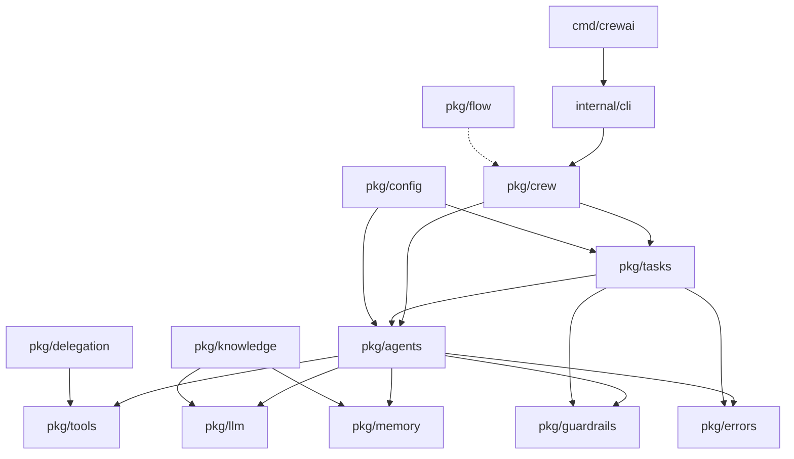

# Architecture

```
Crew-GO/
├── cmd/crewai/           # CLI entrypoint
│   └── main.go
├── internal/cli/         # CLI implementation (not importable by external packages)
│   ├── cli.go
│   └── create.go
├── pkg/                  # Public packages (the framework API)
│   ├── agents/           # Agent definition, ReAct loop, memory/guardrails integration
│   ├── config/           # YAML loaders for agents.yaml and tasks.yaml
│   ├── crew/             # Crew orchestration (Sequential, Hierarchical + Manager Agent)
│   ├── delegation/       # Inter-agent delegation (DelegateWork, AskQuestion)
│   ├── errors/           # Sentinel errors and typed error wrappers
│   ├── flow/             # State-machine flows (conditional, router, parallel, listener)
│   ├── guardrails/       # Output validation middleware (MaxToken, ContentFilter, Schema)
│   ├── knowledge/        # Document ingestion and chunking for RAG
│   ├── llm/              # LLM client interface + OpenAI/Anthropic implementations
│   ├── memory/           # Memory store interface + InMemCosine/SQLite implementations
│   ├── tasks/            # Task definition, context piping, HITL, guardrails
│   └── tools/            # Tool interface + built-in tools (file, web, code, search)
├── examples/
│   ├── researcher_app/   # Simple sequential crew demo
│   └── advanced_app/     # Multi-tool pipeline with structured JSON output
└── docs/
    ├── quickstart.md
    └── advanced_usage.md
```

## Dependency Flow



## Design Principles

1. **Interface-first**: Core abstractions (`llm.Client`, `tools.Tool`, `memory.Store`, `guardrails.Guardrail`) are Go interfaces, making every component swappable.
2. **Context propagation**: Every function takes `context.Context` for timeout, cancellation, and deadline handling.
3. **Concurrency-native**: Hierarchical mode uses `sync.WaitGroup` for parallel task execution. Flows support parallel fan-out nodes.
4. **Error hierarchy**: Custom error types wrap sentinels via `errors.Is`/`errors.As` for precise error handling.
5. **Zero external dependencies for core**: The core (`agents`, `tasks`, `crew`, `flow`, `guardrails`, `errors`, `delegation`) has no external dependencies beyond the Go standard library. Only `llm` (OpenAI SDK), `memory` (SQLite driver), and `config` (YAML parser) import third-party packages.
